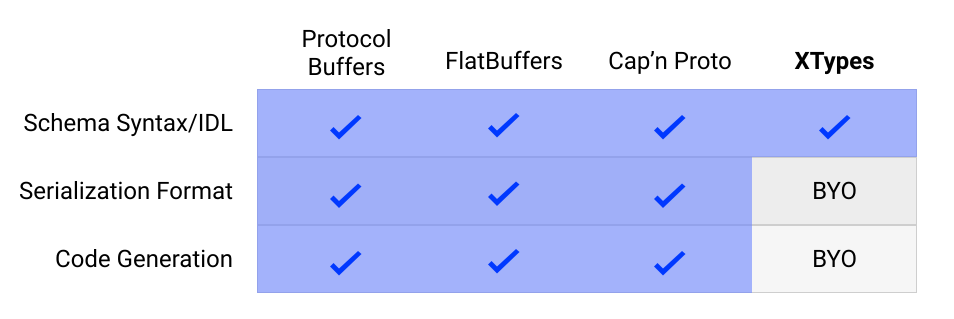

XTypes
=======

XTypes is a cross-language type definition system. It's similar in many ways to Protocol Buffers, FlatBuffers, and Cap'n Proto, but it leaves the serialization format and code generation up to you.

While Protocol Buffers, FlatBuffers and Cap'n Proto all provide an underlying serialization format and code generation facilities to serialize/deserialize into that format, they make assumptions and tradeoffs for this convenience. Some of these assumptions are:

 - Your messages need to continuously evolve.
 - The messages you're describing are not part of an existing protocol (ie, you can use a new serialization format)
 - All fields should be optional, so you need to write code to perform additional null checks (Protobuf v3 & Cap'n Proto)
 - Missing fields can default to 0 or empty string (FlatBuffers)

So why would you use XTypes?

 - To describe the messages in an existing protocol
 - You want to write your own code generator
 - You need more flexibility to describe your messages.
 - You need additional type safety; and
 - Evolvability is not so important (eg you're building software where both ends of the pipe can be deployed at the same time). _Note: You can still make an evolvable protocol with XTypes, but it's up to you to do so_
